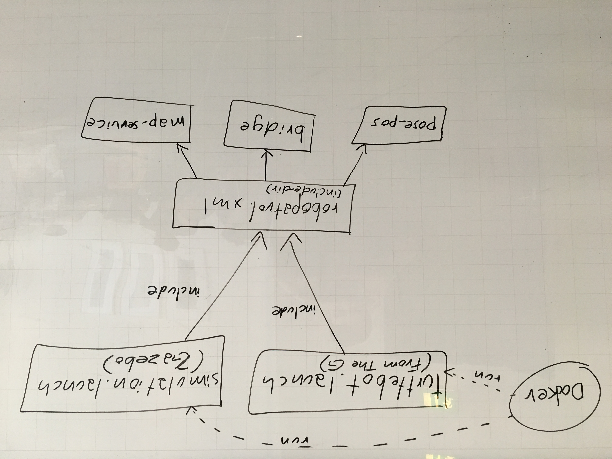

# Launch

There are 2 main launch files. One for simulation (Gazebo) and one for physical Turtlebot hardware.



Inside a Docker image all of the necessary build commands are executed during image creation (mainly catkin setup and build). When an image is launched, something like this is executed:

```shell
source $robopatrol_ws/devel/setup.bash && roslaunch robopatrol simulation.launch gui:=false
```

To build and launch without, look at the [Dockerfile](../Dockerfile) and perform those commands manually. Documentation under `/docs` may also be helful.
